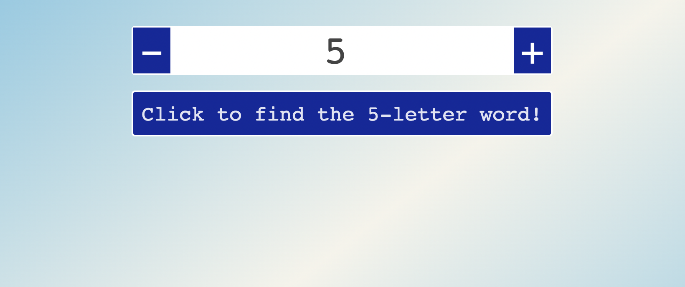
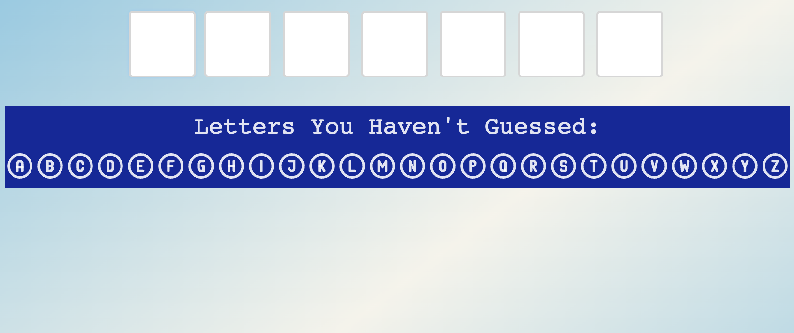
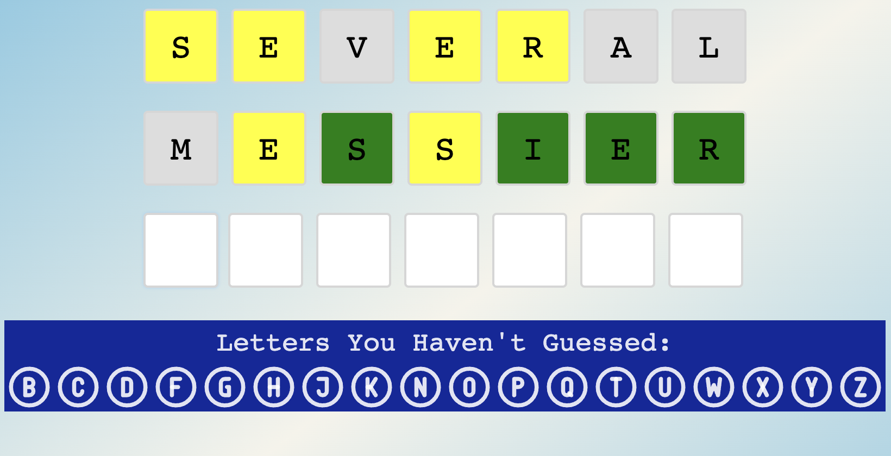
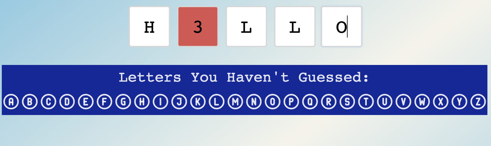
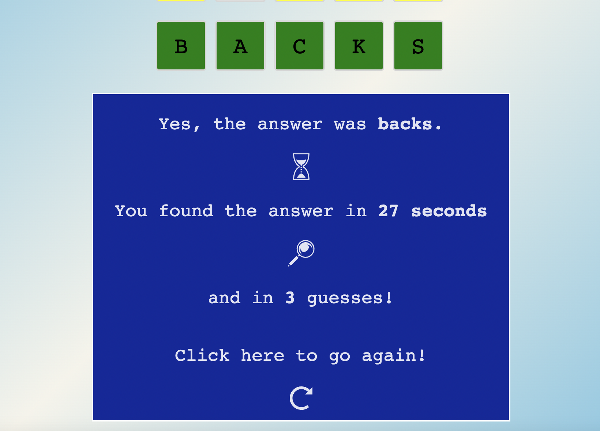

# React.js Word Game

A app is word game similar to Wordle that was developed using React.js. The app allows you to choose the length of the word you want to guess - with options between 2 and 8 characters longs.

The app utilises the <a href='https://www.npmjs.com/package/an-array-of-english-words'>an-array-of-english-words</a> npm package to generate an answer and validate guesses.

### Setup
Clone the repository, open directory with in terminal and run the following commands:
```bash
npm install

npm start
```
This runs  app in the development mode so it is accessible on http://localhost:3000 to view it in your browser.

### Walkthrough

On the start screen you are present with a number picker to choose the length of the answer word. This default to 5 but can be changed to any length between 2 and 8. Clicking the button below confirms the selection and starts the game.

 

When the game starts, you are able to enter your guesses. Press the Enter key to confirm your guess. Below the answer boxes, a list of the letters you have not yet guess is displayed and updated after each guess.

 

If your guess shares a letter in the same position, it will be green. If a letter is present in the answer but in a different position it will be yellow.

 

If you type an non-alphabetical character the box will show in red. If you type and enter a guess that is not a valid word, all boxes will turn red.

 

Once you find the word, you will see a summary showing how long it took you to find the word and how many guesses you made. Here you can also click to go again.

 

 